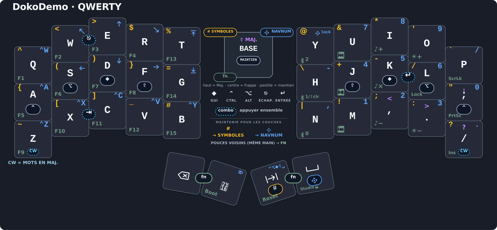
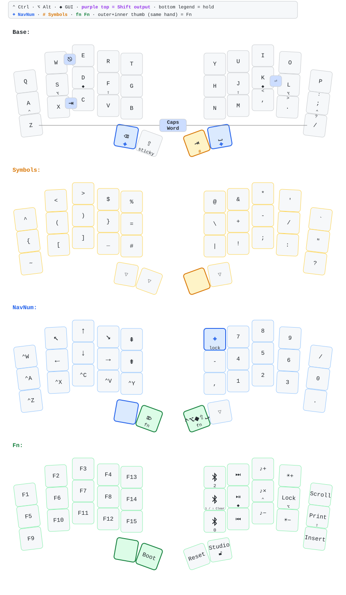

[Download the SVG version](keymap-drawer/keymap-compact.svg).

# ZMK Configuration for DokoDemo

This repository contains the default DokoDemo firmware and keymap. The keymap
uses QWERTY and is inspired by Selenium's compact layer design, with a
per-finger home-row mod scheme adapted from a larger go60-style split.

Highlights:

- per-finger bilateral home-row mods in Ctrl, Alt, GUI, Shift order
  (pinky-to-index), mirrored on both hands;
- sticky Shift plus dual Backspace/Space NavNum thumb keys;
- a shared navigation and numpad layer;
- Selenium-style Symbols and Fn/Media layers; and
- Caps Word, Escape, Tab, and Enter combos.

## Detailed keymap



Regenerate the parsed keymap and SVG with:

## Re-building the keymap

```sh
make keymap
```

This also creates `keymap-drawer/keymap-compact.svg`: one physical keyboard
with color-coded values from every user-facing layer. Run `make keymap-compact`
when you only need to refresh the shareable composite SVG.

Create the tracked 3840px PNG used above with:

```sh
make keymap-compact-png
```

This optional export target requires `rsvg-convert` from librsvg. Override its
path with `RSVG_CONVERT=/path/to/rsvg-convert` when needed.

This uses the globally installed `keymap` executable. Saving
`keymap-drawer/keymap.yaml` in VS Code also redraws the SVG when the recommended
Run on Save extension is installed.

Create a three-page, print-ready A4 PDF with:

```sh
make keymap-print
```

The PDF is written to `keymap-drawer/keymap-print.pdf`. This target requires GNU
Make, the global `keymap` executable, Python 3 with PyYAML, and Chromium. Set
`CHROMIUM=/path/to/browser` if the executable has a different name.
